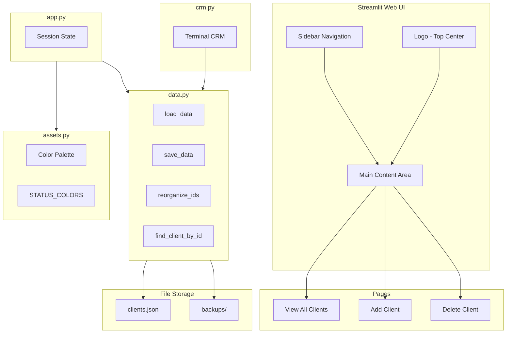
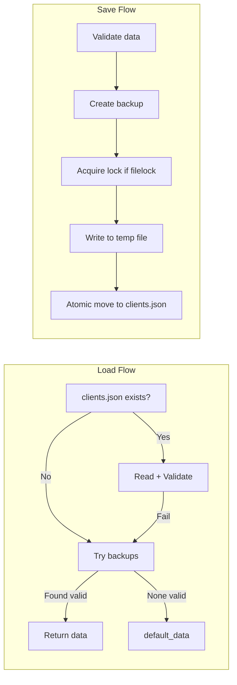
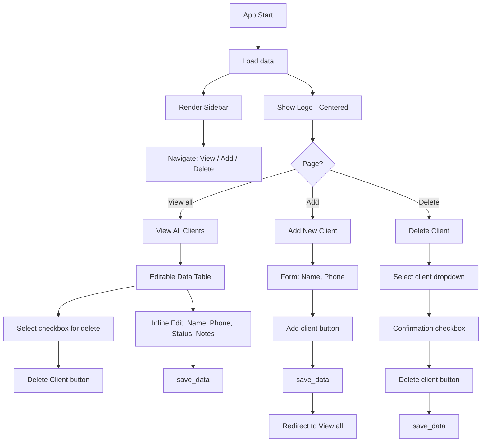

# Mini CRM — Complete Documentation and Replication Guide

This document describes the Mini CRM architecture so it can be understood and replicated by someone unfamiliar with the codebase.

---

## 1. Architecture Overview



---

## 2. Project Structure

| File/Folder | Purpose |
|-------------|---------|
| [src/app.py](src/app.py) | Entry point: loads data, renders layout, routes to pages |
| [src/client_management.py](src/client_management.py) | Client logic: view_all_clients, add_client, delete_client |
| [src/data.py](src/data.py) | Data layer: load, save, backup, validation, locking |
| [src/assets.py](src/assets.py) | UI: themes, styles, logo, sidebar |
| [src/crm.py](src/crm.py) | Terminal-based CRM (shares data.py and clients.json) |
| [.streamlit/config.toml](.streamlit/config.toml) | Streamlit theme (see Section 6 for values) |
| [requirements.txt](requirements.txt) | Dependencies: streamlit, pandas, filelock, colorama |
| [assets/logo_ramayana.png](assets/logo_ramayana.png) | Brand logo (top center of main area) |
| [clients.json](clients.json) | Main data file (gitignored) |
| [backups/](backups/) | Timestamped backups (gitignored) |
| [docs/ARCHITECTURE.md](docs/ARCHITECTURE.md) | This documentation |
| [docs/diagrams.html](docs/diagrams.html) | Visual diagrams (open in browser to view) |
| [docs/DEPLOYMENT.md](docs/DEPLOYMENT.md) | How to deploy and share the app via browser |
| [docs/SUPABASE_SETUP.md](docs/SUPABASE_SETUP.md) | Supabase database setup for persistent shared data |
| [run.py](run.py) | Convenience entry point: `python run.py` runs the web app |

---

## 3. Data Model and Storage

**Client object schema:**
```json
{
  "id": 1,
  "name": "Client Name",
  "phone": "0980123456",
  "status": "interested|student|client",
  "notes": [
    { "date": "2026-03-13 15:00", "text": "Note content" }
  ]
}
```

**Root data structure:**
```json
{
  "next_id": 17,
  "clients": [ /* array of client objects */ ]
}
```

**Notes format in UI:** `YYYY-MM-DD HH:MM: text` (one line per note)

**Notes parsing (`parse_notes_text`):** Lines with format `YYYY-MM-DD HH:MM: text` (date at positions 0–16, colon-space at 16–18) keep their date. Lines without this format get current timestamp. Empty lines are skipped.

**Storage:** When `SUPABASE_URL` and `SUPABASE_KEY` are configured (via `.env` or Streamlit Secrets), data is stored in Supabase. Otherwise, the app uses `clients.json` locally. See [docs/SUPABASE_SETUP.md](docs/SUPABASE_SETUP.md).

---

## 4. Data Flow and Security



**Security measures:**
- Atomic write: temp file → `shutil.move` to `clients.json`
- Backup before each save: `backups/clients_YYYYMMDD_HHMMSS.json`
- Backup rotation: keep last 10
- Fallback on corruption: try backups if main file fails
- Optional file locking: `filelock` prevents concurrent writes

---

## 5. UI Flow and Pages



**Page details:**
- **View all clients**: `st.data_editor` with Select, ID, Name, Phone, Status, Notes; inline edits auto-save; select + Delete Client
- **Add client**: Form with Name, Phone; default status `interested`; redirect to View all on success
- **Delete client**: Selectbox, warning, confirmation checkbox, then delete

**Session state keys:**
- `nav_page` — Current page (View all / Add / Delete)
- `redirect_to_all` — Flag to redirect to View all after adding client
- `show_saved` — Flag to show "Saved" message after add/edit/delete
- `selected_client_id` — ID of client selected for deletion in View all

**When `reorganize_ids` is called:** On add client, on delete client, and when name changes in inline edit (IDs are reassigned 1..N by alphabetical name order).

---

## 6. Theme and Styling

**Palette (from [assets.py](assets.py)):**
- MOSS `#5A6D4C` — Primary actions, buttons
- CYPRESS `#3D4F3A` — Sidebar, headers
- OLIVE `#7A8B6E` — Secondary
- ALOE `#B8D4B4` — Light backgrounds, success
- CEDAR `#8B7355` — Borders, accents
- CREAM `#F5F3EE` — Main background

**Status colors:** interested → OLIVE, student → ALOE, client → MOSS

**Visual elements:**
- Background: cream + 4 corner radial gradients (aloe, olive, moss, cedar)
- Abstract lines: SVG paths overlay (opacity 0.18)
- Sidebar: cypress → moss gradient, white text
- Font: Nunito (Google Fonts)

**Streamlit config** (`.streamlit/config.toml`):
```toml
[theme]
primaryColor = "#5A6D4C"
backgroundColor = "#F5F3EE"
secondaryBackgroundColor = "#E8EDE4"
textColor = "#3D4F3A"
font = "sans serif"
```

**`.gitignore` contents:**
```
clients.json
backups/
```

---

## 7. Replication Steps

1. **Prerequisites:** Python 3.10+, pip
2. **Clone/copy** project folder
3. **Install:** `pip install -r requirements.txt`
4. **Add logo:** Place `logo_ramayana.png` in `assets/` (or update path in [src/assets.py](src/assets.py))
5. **Run web app:** `streamlit run src/app.py` or `python run.py` (from project root)
6. **Run terminal app (optional):** `python src/crm.py` — uses same `clients.json`; requires `colorama`
7. **Data:** `clients.json` created on first save; backups in `backups/`

**Optional:** Remove logo line (231–233) if no logo; app works without it (will show error if file missing — consider `st.image` only if file exists).

---

## 8. Terminal CRM (crm.py)

The project includes a terminal-based CRM that shares the same data layer. Run with `python src/crm.py`. It uses `colorama` for colored output. Both the web app and terminal app read/write the same `clients.json`; changes in one are visible in the other.
